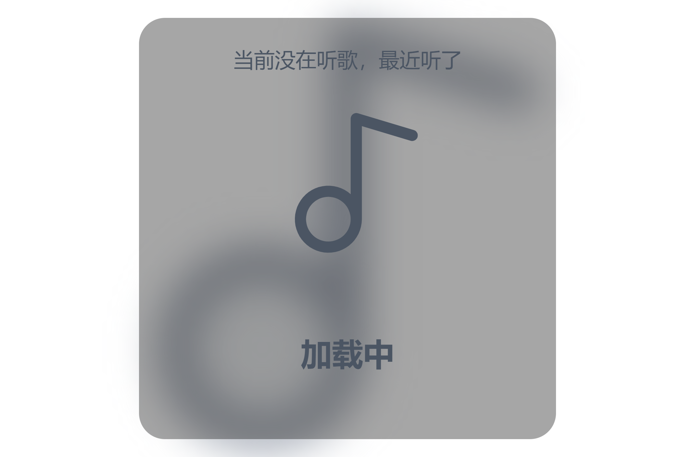

# playing-music

Show the music I am currently listening to through last.fm API

通过 last.fm API 展示我当前正在听的音乐

# Server

后端使用 `PHP` 写了个简单的接口请求，并提供缓存

详情参考 [server/index.php](./server/index.php)

# Screenshot

加载中

播放过的音乐

# Process

